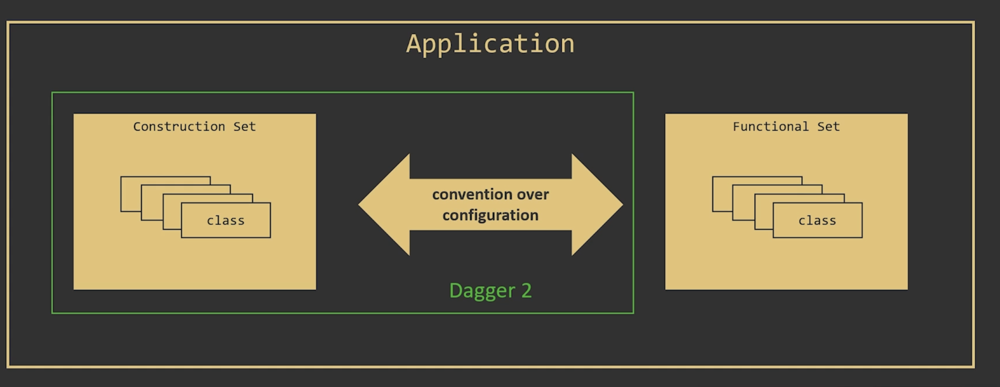
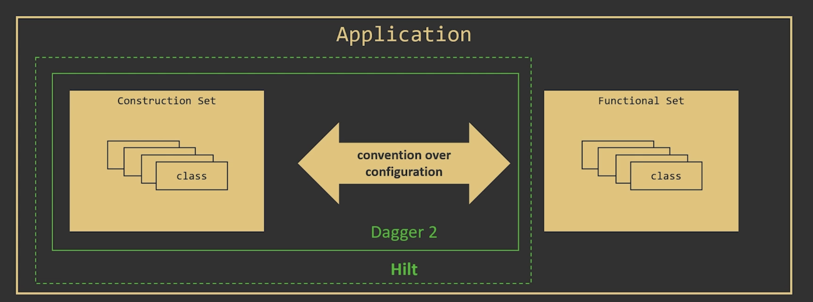
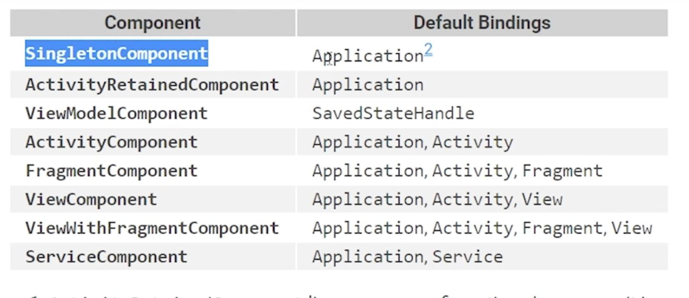
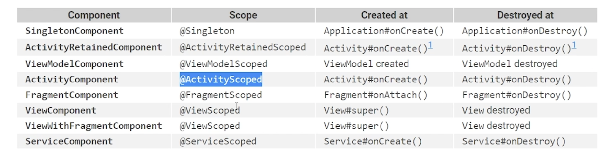

# Dagger & Hilt







# v.1.0 - Hilt Installation

- App Level Gradle

```kotlin
apply plugin: 'com.android.application'
apply plugin: 'kotlin-android'
apply plugin: 'kotlin-kapt'
// Hilt Related
apply plugin: 'dagger.hilt.android.plugin'

android {
    compileSdkVersion 29
    defaultConfig {
        applicationId "com.techyourchance.dagger2course"
        minSdkVersion 19
        targetSdkVersion 29
        versionCode 1
        versionName "1.0"
        vectorDrawables.useSupportLibrary = true
    }
    buildTypes {
        release {
            minifyEnabled false
            proguardFiles getDefaultProguardFile('proguard-android.txt'), 'proguard-rules.pro'
        }
    }
    compileOptions {
        sourceCompatibility = 1.8
        targetCompatibility = 1.8
    }
}

// Hilt Related
kapt {
    correctErrorTypes true
}

dependencies {
    implementation fileTree(dir: 'libs', include: ['*.jar'])

    implementation "org.jetbrains.kotlin:kotlin-stdlib-jdk7:$kotlin_version"

    // Image loading
    implementation 'com.github.bumptech.glide:glide:4.11.0'
    annotationProcessor 'com.github.bumptech.glide:compiler:4.11.0'

    implementation 'androidx.appcompat:appcompat:1.2.0'
    implementation 'androidx.recyclerview:recyclerview:1.2.0'
    implementation 'androidx.swiperefreshlayout:swiperefreshlayout:1.1.0'
    implementation 'androidx.lifecycle:lifecycle-viewmodel-ktx:2.3.1'
    implementation "androidx.lifecycle:lifecycle-viewmodel-savedstate:2.3.1"

    implementation 'com.squareup.retrofit2:retrofit:2.6.1'
    implementation 'com.squareup.retrofit2:converter-gson:2.6.1'

    implementation 'org.jetbrains.kotlinx:kotlinx-coroutines-core:1.4.1'
    implementation 'org.jetbrains.kotlinx:kotlinx-coroutines-android:1.4.1'

    //Hilt Related
    implementation "com.google.dagger:hilt-android:$hilt_version"
    kapt "com.google.dagger:hilt-compiler:$hilt_version"
}
```

- Application Level Gradle

```kotlin
buildscript {
    ext {
        kotlin_version = '1.4.32'
        hilt_version = '2.35.1'
    }

    repositories {
        google()
        mavenCentral()
    }

    dependencies {
        classpath 'com.android.tools.build:gradle:4.1.3'
        classpath "org.jetbrains.kotlin:kotlin-gradle-plugin:$kotlin_version"
        // Hilt Related
        classpath "com.google.dagger:hilt-android-gradle-plugin:$hilt_version"
    }
}

allprojects {
    repositories {
        google()
        mavenCentral()
    }
}

task clean(type: Delete) {
    delete rootProject.buildDir
}
```

# V.2.0

### Annotate App as `HiltAndroidApp`

```kotlin
@HiltAndroidApp
class MyApplication: Application() {

    override fun onCreate() {
        super.onCreate()
    }

}
```

# V.3.0

- Delete all Components
- Implement InstallIn

```kotlin
@Module
@InstallIn(ActivityComponent::class)
abstract class ActivityModule {

    @ActivityScope
    @Binds
    abstract fun screensNavigator(screensNavigatorImpl: ScreensNavigatorImpl): ScreensNavigator

    companion object {
        @Provides
        fun layoutInflater(activity: AppCompatActivity) = LayoutInflater.from(activity)

        @Provides
        fun fragmentManager(activity: AppCompatActivity) = activity.supportFragmentManager
    }

}
```

⇒ ActivityComponent will expose its modules to `Application`, `Activity`

```kotlin
@Module
@InstallIn(SingletonComponent::class)
class AppModule { //AppModule should have no argument

    @Provides
    @AppScope
    @Retrofit1
    fun retrofit1(urlProvider: UrlProvider): Retrofit {
        return Retrofit.Builder()
                .baseUrl(urlProvider.getBaseUrl1())
                .addConverterFactory(GsonConverterFactory.create())
                .build()
    }

    @Provides
    @AppScope
    @Retrofit2
    fun retrofit2(urlProvider: UrlProvider): Retrofit {
        return Retrofit.Builder()
                .baseUrl(urlProvider.getBaseUrl2())
                .addConverterFactory(GsonConverterFactory.create())
                .build()
    }

    @AppScope
    @Provides
    fun urlProvider() = UrlProvider()

    @Provides
    @AppScope
    fun stackoverflowApi(@Retrofit1 retrofit: Retrofit) = retrofit.create(StackoverflowApi::class.java)

}
```

⇒ SingletonComponent will expose its modules to `Application`

### Component Default Bindings

- SingletonComponent - Application
- ActivityRetainedComponent - Application
- ViewModelComponent - SavedStateHandle
- ActivityComponent - Application, Activity
- FragmentComponent - Application, Activity, Fragment
- ViewComponent - Application, Activity, View
- ViewWithFragmentComponent - Application, Activity, Fragment, View
- ServiceComponent - Application, Service

# V.4.0


⇒ You can't use custom scopes in Hilt.

### Provide Default Scope

```kotlin
@Module
@InstallIn(ActivityComponent::class)
abstract class ActivityModule {

    @ActivityScoped
    @Binds
    abstract fun screensNavigator(screensNavigatorImpl: ScreensNavigatorImpl): ScreensNavigator

    companion object {
        @Provides
        fun layoutInflater(activity: AppCompatActivity) = LayoutInflater.from(activity)

        @Provides
        fun fragmentManager(activity: AppCompatActivity) = activity.supportFragmentManager
    }

}
```

⇒ We deleted custom ActivityScope and replaced it with default scope `ActivityScoped`

### Make an alias scope

```kotlin
@Scope
@AliasOf(Singleton::class)
annotation class AppScope {
}
```

```kotlin
@Module
@InstallIn(SingletonComponent::class)
class AppModule { //AppModule should have no argument

    @Provides
    @AppScope
    @Retrofit1
    fun retrofit1(urlProvider: UrlProvider): Retrofit {
        return Retrofit.Builder()
                .baseUrl(urlProvider.getBaseUrl1())
                .addConverterFactory(GsonConverterFactory.create())
                .build()
    }

    @Provides
    @AppScope
    @Retrofit2
    fun retrofit2(urlProvider: UrlProvider): Retrofit {
        return Retrofit.Builder()
                .baseUrl(urlProvider.getBaseUrl2())
                .addConverterFactory(GsonConverterFactory.create())
                .build()
    }

    @AppScope
    @Provides
    fun urlProvider() = UrlProvider()

    @Provides
    @AppScope
    fun stackoverflowApi(@Retrofit1 retrofit: Retrofit) = retrofit.create(StackoverflowApi::class.java)

}
```

# v.5.0 - ViewModel with hilt

- No need for ViewModelFactory
- @HiltViewModel takes care of extra argument such as `savedStateHandle`

```kotlin
@HiltViewModel
class MyViewModel @Inject constructor(
        private val fetchQuestionsUseCase: FetchQuestionsUseCase,
        private val fetchQuestionDetailsUseCase: FetchQuestionDetailsUseCase,
        private val savedStateHandle: SavedStateHandle
): ViewModel() {

    private var _questions: MutableLiveData<List<Question>> = savedStateHandle.getLiveData("questions")
    val questions: LiveData<List<Question>> get() = _questions

    init {
        viewModelScope.launch {
            delay(5000)
            val result = fetchQuestionsUseCase.fetchLatestQuestions()
            if (result is FetchQuestionsUseCase.Result.Success) {
                _questions.value = result.questions
            } else {
                throw RuntimeException("fetch failed")
            }
        }
    }
}
```

```kotlin
@AndroidEntryPoint
class ViewModelActivity : BaseActivity() {

    @Inject lateinit var screensNavigator: ScreensNavigator

    private lateinit var myViewModel: MyViewModel
    private lateinit var myViewModel2: MyViewModel2

    private lateinit var toolbar: MyToolbar

    override fun onCreate(savedInstanceState: Bundle?) {
        super.onCreate(savedInstanceState)

        setContentView(R.layout.layout_view_model)

        toolbar = findViewById(R.id.toolbar)
        toolbar.setNavigateUpListener {
            screensNavigator.navigateBack()
        }

        myViewModel = ViewModelProvider(this).get(MyViewModel::class.java)
        myViewModel2 = ViewModelProvider(this).get(MyViewModel2::class.java)

        myViewModel.questions.observe(this, Observer {
            questions -> Toast.makeText(this, "fetched ${questions.size} questions", Toast.LENGTH_SHORT).show()
        })
    }

    companion object {
        fun start(context: Context) {
            val intent = Intent(context, ViewModelActivity::class.java)
            context.startActivity(intent)
        }
    }
}
```

# v.6.0 - simplify viewmodel initialization

### App Level Gradle

```kotlin
apply plugin: 'com.android.application'
apply plugin: 'kotlin-android'
apply plugin: 'kotlin-kapt'
// Hilt Related
apply plugin: 'dagger.hilt.android.plugin'

android {
    compileSdkVersion 29
    defaultConfig {
        applicationId "com.techyourchance.dagger2course"
        minSdkVersion 19
        targetSdkVersion 29
        versionCode 1
        versionName "1.0"
        vectorDrawables.useSupportLibrary = true
    }
    buildTypes {
        release {
            minifyEnabled false
            proguardFiles getDefaultProguardFile('proguard-android.txt'), 'proguard-rules.pro'
        }
    }
    //Simplify ViewModel
    kotlinOptions {
        jvmTarget = 1.8
    }
    compileOptions {
        sourceCompatibility = 1.8
        targetCompatibility = 1.8
    }
}

// Hilt Related
kapt {
    correctErrorTypes true
}

dependencies {
    implementation fileTree(dir: 'libs', include: ['*.jar'])

    implementation "org.jetbrains.kotlin:kotlin-stdlib-jdk7:$kotlin_version"

    // Image loading
    implementation 'com.github.bumptech.glide:glide:4.11.0'
    annotationProcessor 'com.github.bumptech.glide:compiler:4.11.0'

    implementation 'androidx.appcompat:appcompat:1.2.0'
    implementation 'androidx.recyclerview:recyclerview:1.2.0'
    implementation 'androidx.swiperefreshlayout:swiperefreshlayout:1.1.0'
    implementation 'androidx.lifecycle:lifecycle-viewmodel-ktx:2.3.1'
    implementation "androidx.lifecycle:lifecycle-viewmodel-savedstate:2.3.1"

    //Simplify ViewModel
    implementation "androidx.activity:activity-ktx:1.2.3"

    implementation 'com.squareup.retrofit2:retrofit:2.6.1'
    implementation 'com.squareup.retrofit2:converter-gson:2.6.1'

    implementation 'org.jetbrains.kotlinx:kotlinx-coroutines-core:1.4.1'
    implementation 'org.jetbrains.kotlinx:kotlinx-coroutines-android:1.4.1'

    //Hilt Related
    implementation "com.google.dagger:hilt-android:$hilt_version"
    kapt "com.google.dagger:hilt-compiler:$hilt_version"
}
```

```kotlin
@AndroidEntryPoint
class ViewModelActivity : BaseActivity() {

    @Inject lateinit var screensNavigator: ScreensNavigator

    private val myViewModel: MyViewModel by viewModels()
    private val myViewModel2: MyViewModel2 by viewModels()

    private lateinit var toolbar: MyToolbar

    override fun onCreate(savedInstanceState: Bundle?) {
        super.onCreate(savedInstanceState)

        setContentView(R.layout.layout_view_model)

        toolbar = findViewById(R.id.toolbar)
        toolbar.setNavigateUpListener {
            screensNavigator.navigateBack()
        }

//        myViewModel = ViewModelProvider(this).get(MyViewModel::class.java)
//        myViewModel2 = ViewModelProvider(this).get(MyViewModel2::class.java)

        myViewModel.questions.observe(this, Observer {
            questions -> Toast.makeText(this, "fetched ${questions.size} questions", Toast.LENGTH_SHORT).show()
        })
    }

    companion object {
        fun start(context: Context) {
            val intent = Intent(context, ViewModelActivity::class.java)
            context.startActivity(intent)
        }
    }
}
```

# Hilt Summary

- Hilt is kind of "opinionated" Dagger 2

### Main Features of Hilt

- Use predefined set of implicit Components
- Each predefined Component is associated with a predefined Scope
- Automatically provides specific bootstrapping services (e.g. Application)
- Modules specify in which Components they should be installed
- Simplified ViewModel handling

### Potential concerns with Hilt

- Bugs
- Impact on build times
- Impact on incremental builds stability
- More?

# How to use Hilt step by step

### 1. Declare your app as HiltAndroidApp

```kotlin
@HiltAndroidApp
class MyApplication: Application() {

    override fun onCreate() {
        super.onCreate()
    }

}
```

### 2. Define Module

- with `@InstallIn` and provided component
- with Default Scope provided by hilt, here `@ActivityScoped`

```kotlin
@Module
@InstallIn(ActivityComponent::class)
abstract class ActivityModule {

    @ActivityScoped
    @Binds
    abstract fun screensNavigator(screensNavigatorImpl: ScreensNavigatorImpl): ScreensNavigator

    companion object {

        @Provides
        fun appCompatActivity(activity: Activity): AppCompatActivity = activity as AppCompatActivity

        @Provides
        fun layoutInflater(activity: Activity) = LayoutInflater.from(activity)

        @Provides
        fun fragmentManager(activity: AppCompatActivity) = activity.supportFragmentManager
    }

}
```

### 3. Declare `@AndroidEntryPoint` where dependency injection is needed

- No need for inject method like dagger

```kotlin
@AndroidEntryPoint
class QuestionDetailsActivity : BaseActivity(), QuestionDetailsViewMvc.Listener {

    private val coroutineScope = CoroutineScope(SupervisorJob() + Dispatchers.Main.immediate)

    @Inject lateinit var fetchQuestionDetailsUseCase: FetchQuestionDetailsUseCase
    @Inject lateinit var dialogsNavigator: DialogsNavigator
    @Inject lateinit var screensNavigator: ScreensNavigator
    @Inject lateinit var viewMvcFactory: ViewMvcFactory

    private lateinit var viewMvc: QuestionDetailsViewMvc

    private lateinit var questionId: String

    override fun onCreate(savedInstanceState: Bundle?) {
        super.onCreate(savedInstanceState)
        viewMvc = viewMvcFactory.newQuestionDetailsViewMvc(null)
        setContentView(viewMvc.rootView)

        questionId = intent.extras!!.getString(EXTRA_QUESTION_ID)!!
    }

    override fun onStart() {
        super.onStart()
        viewMvc.registerListener(this)
        fetchQuestionDetails()
    }

    override fun onStop() {
        super.onStop()
        coroutineScope.coroutineContext.cancelChildren()
        viewMvc.unregisterListener(this)
    }

    private fun fetchQuestionDetails() {
        coroutineScope.launch {
            viewMvc.showProgressIndication()
            try {
                val result = fetchQuestionDetailsUseCase.fetchQuestion(questionId)
                when(result) {
                    is FetchQuestionDetailsUseCase.Result.Success -> {
                        viewMvc.bindQuestionWithBody(result.question)
                    }
                    is FetchQuestionDetailsUseCase.Result.Failure -> onFetchFailed()
                }
            } finally {
                viewMvc.hideProgressIndication()
            }

        }
    }

    private fun onFetchFailed() {
        dialogsNavigator.showServerErrorDialog()
    }

    override fun onBackClicked() {
        screensNavigator.navigateBack()
    }

    companion object {
        const val EXTRA_QUESTION_ID = "EXTRA_QUESTION_ID"
        fun start(context: Context, questionId: String) {
            val intent = Intent(context, QuestionDetailsActivity::class.java)
            intent.putExtra(EXTRA_QUESTION_ID, questionId)
            context.startActivity(intent)
        }
    }
}
```
